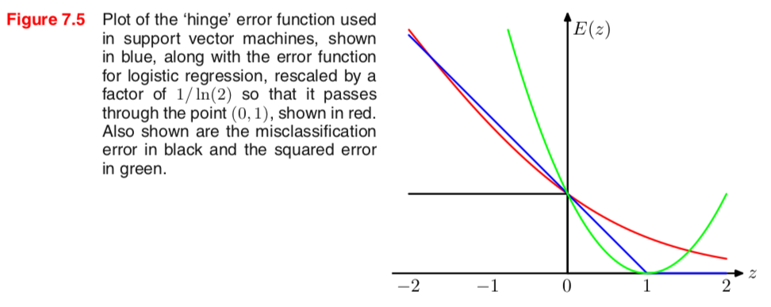
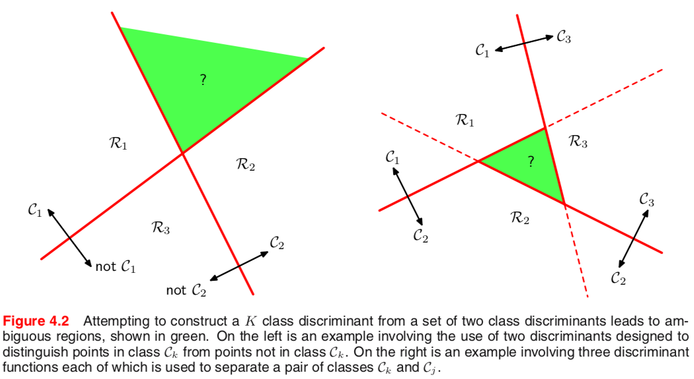
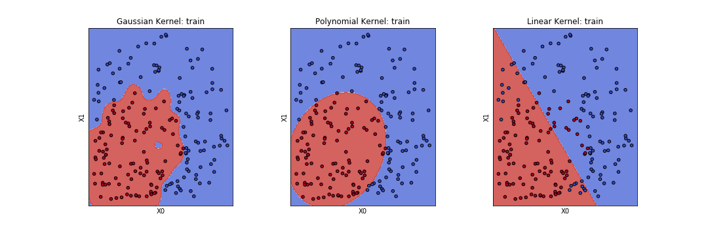
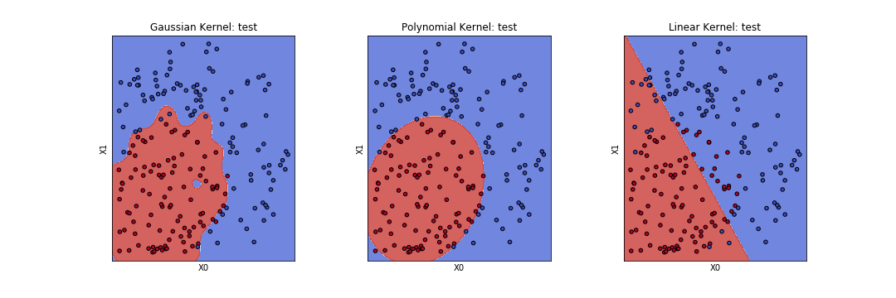
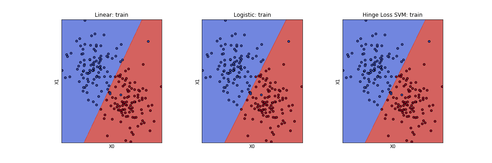
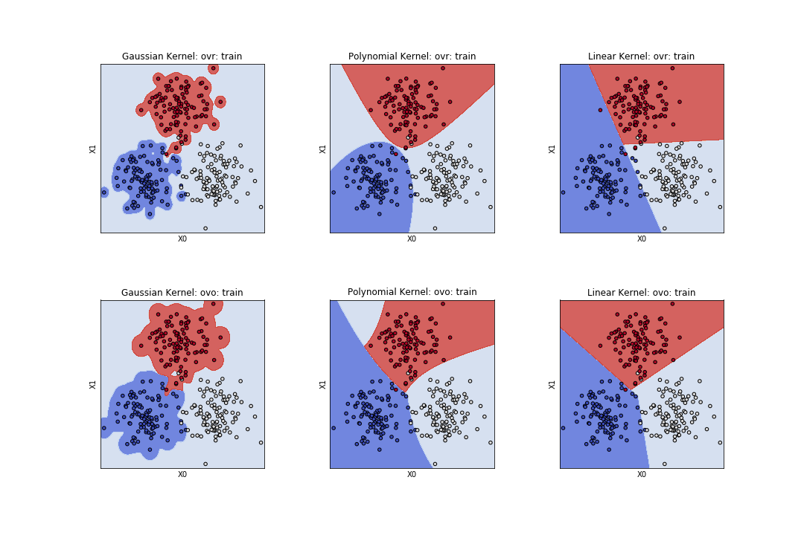
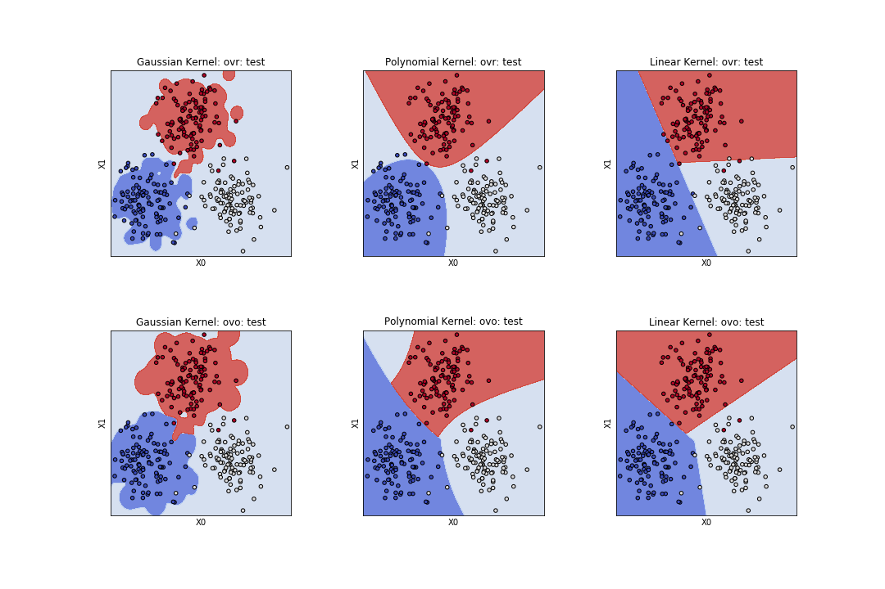

# Report for SVM

周海沧

15307130269

## Abstract

本次作业需要实现 SVM ，将其做二分类，并和线性模型进行对比，最后还需要将多个二分类的 SVM 进行组合以实现多分类的任务。在本次作业中，我实现了基于凸优化的 SVM（包括高斯核、多项式核、线性核）以及基于 hinge loss 的 SVM（线性核），并使用 ovr 和 ovo 将多个二分类 SVM 进行组合以处理多分类问题。基于高斯核（或者多项式核）的 SVM 能够很好地完成非线性可分的二分类问题，基于 hinge loss 的 SVM 能够达到与 logistic regression 相似的效果，而使用 ovr 与 ovo 也能够比较好地完成多分类任务。

## A Brief Intro to SVM

基于 Kernel 的方法通过对原始的训练数据进行“记忆”以处理新的问题，但传统的 Kernel 算法中，由于模型参数和训练样本数一样，因此在做预测时很慢。而 SVM 是一种 Sparse Vector Machine，即 SVM 的参数是稀疏的，在预测模型中，SVM 只与少量的几个 Support Vectors 有关，如下：
$$
y(\mathbf{x}) = \sum_{n = 1}^{N} a_n t_n kernel(\mathbf{x}, \mathbf{x}_n) + b
$$
在 (1) 中，$a_n$ 是第 n 个训练样本对应的参数，$t_n$ 是第 n 个训练样本对应的 target，$kernel(\mathbf{x}, \mathbf{x}_n)$ 是测试样本与第 n 个训练样本的 kernel，$b$ 是整个模型的 intercept。Sparse 的意思是 $a_n$ 中很多都是 0 ，因此在测试的时候可以很高效。

SVM 的优化目标如下：
$$
\max \widetilde{L} = \sum_{n=1}^N a_n - \frac{1}{2} \sum_{n=1}^{N} \sum_{m=1}^{N} a_n a_m t_n t_m Kernel(x_n, x_m) \\
s.t. \quad 0 \le a_n \le C  \\
\qquad \sum_{n=1}^N a_n t_n = 0
$$
这是一个带约束条件的二次规划问题。由于训练样本数 $N$ 一般比较大，因此一般的二次规划会比较慢（比如内存超限等影响），对于 SVM 有很多的优化算法，比如 Chunking，smo 等。然而这些算法实现起来都比较麻烦，并考虑到这次作业的数据量不大，而且现在计算机的性能也足够，因此我使用了二次规划的库进行优化。

另外，当 SVM 的 Kernel 是一种可以直接计算的有限维的 Kernel 时，可以使用 hinge loss 进行优化，即将 (2) 式转化为等价的 loss function 然后用梯度下降等数值优化算法对 loss 最小化，hinge loss 定义如下：
$$
E_{hinge} = \sum_{n=1}^{N} [1 - y_n t_n]_{+} + \lambda ||\mathbf{w}||^2
$$
式子中 $[\cdot]_+$ 表示方括号里的式子大于零则取该值，反之取0。

### Comparation between SVM, Linear and Logistic Regression

这里指定了是线性分类问题，SVM 基于 hinge loss，实际上就是比较三种 loss function，图如下：

**图 1 几种损失函数的比较**

### Multiple Class SVM

SVM 是一个典型的二分类模型，因此可以使用 ovr 和 ovo 将二分类 SVM 扩展成多分类的模型，但不论是 ovr 还是 ovo 都存在 ambiguous region。图示如下（左图是 ovr，右图是 ovo）：

**图 2 将二分类模型组合成多分类模型时带来的模糊区域**

在结果中 ambiguous region 对带来一些影响。

## Implementation

基于效率考虑，代码都使用向量化的方式进行实现。

在代码中，我实现了基于高斯核、线性核与多项式核的 SVM。因为核函数在 SVM 的训练和预测中需要用到多次，因此核函数的计算应该高效，所以我在核函数中使用了向量化的代码。

SVM 的优化分为 公式(2) 和 公式(3) 两种，对于 公式(2) 的二次规划，我调用了 [cvxopt](cvxopt.org) 凸优化库。调库需要将 公式(2) 表示成二次规划的标准形式，在下式中我列出了标准形式和每个参数在 SVM 优化中的意义。

$$
\min \widetilde{M} = \frac{1}{2} a^T P a + q^T a \\
s.t. \quad Ga \le h \\
\qquad Ax = h 
\\
-------- \\
P = (t \cdot t^T) * K  \qquad q = -(1, 1, \dots, 1)^T \\
G = 
\begin{pmatrix}
I_n \\
-I_n
\end{pmatrix}
\qquad
h = 
\begin{pmatrix}
\vec{C}_{n \times 1} \\
\vec{0}_{n \times 1}
\end{pmatrix} \\
A = diag(t) \qquad
b = \vec{0}_{n \times 1}
$$

训练完成后，我将 Support Vectors 和其对应的 $a_n$ 保存在了模型里。基于效率考虑，代码也使用向量化的方式进行实现。

在 hinge loss 中，我使用了最简单的前向传播和反向传播最小化损失函数，具体的公式不再赘述。

在线性分类的对比中，我实现了基于平方误差的线性分类器以及 Logistic Regression。我都使用梯度下降对这两个模型进行优化。

在多分类 SVM 中，我使用了 one-versus-the rest 和 one-versus-one 的组合策略。

以上的这些算法代码我都写在 `svm.py` 中，在 `utils.py` 中，我实现了一些用于展示的函数；在 `test_model.ipynb` 中，我对模型进行了简单的测试和超参数调整，在 `show_model.py` 中，我对各个模型进行了可视化的展示。

## RESULTS AND VISUALIZATION

在可视化的展示中，由于高斯核与多项式核 SVM 是非线性模型，其边界不易直接确定；因此我采用了网格线（mesh grid）的方法，将不同类别的区域染成不同的颜色。

### Different Kernel Functions

在非线性可分的二分类问题中，高斯核、多项式核（默认 2次）、线性核三种核函数的 SVM 的效果图如下：

**图 3 不同核函数的 SVM 处理线性不可分的二分类问题**

其对应的正确率如下表：

| Kernel function | Accuracy: train | Accuracy: test |
| :-------------: | :-------------: | :-------------: |
|    gaussian     |     1.00    |0.95|
|   polynomial    |     0.985   |0.98|
|     linear      |      0.81   |0.81|

这是一个非线性可分的二分类问题，所以线性核很正常地表现得比较差。而高斯核与多项式核都表现得比较好，这里我没有再做更多的参数调整。

对比训练集准确率于测试集准确率，高斯核这里有比较明显的过拟合，反应在可视化图中，则是边缘上的锯齿。高斯核比较神奇的一点是，在最左边的图中，红色区域的中间出现了一小块蓝色的区域，这块区域的周围正好红色点（训练集中）比较稀疏。因为高斯核是无限维的，因此将其投影到二维平面会出现“非线性”的效果。然而这种情况其实是我们不愿意看到的。

另外我还比较了不同次数的多项式核，效果图和准确率在这里略去，但可以参考 `show_model.py` 。

### Linear Classifiers

在线性分类器的比较中，三种模型的结果图如下。

**图 4 三种线性分类器的比较**

它们的准确率如下：

|             Model              |Accuracy: train | Accracy: test |
| :----------------------------: | :-----------: | :-----------: |
|     Linear (Square Error)      |    0.96   |0.98|
|      Logistic Regression       |     0.95  |0.96|
| hinge loss SVM (Linear Kernel) |     0.95     |0.965|

其实从图上来看，三种模型的分类效果很接近。从准确率来看，它们也没有太大的差别，仅有的误差出现在分界面上的那几个点。尽管平方误差并不是一个很好的分类 loss ，但是由于这个测试数据的数据点都比较集中，而且距离分界面不远，因此它的弊端没有显示出来。

### Multiple class classification with SVM

这里我使用了三种核函数（高斯、多项式、线性）在 ovr 和 ovo 两种策略下进行了 6 次实验，结果如下：

**图 6 不同核函数与不同组合策略的比较**

|   Kernel   | ovr (train, test) | ovo (train, test) |
| :--------: | :---------------: | :---------------: |
|  gaussian  |   (1.00, 0.91)    |   (1.00, 0.956)   |
| polynomial |   (0.98, 0.96)    |  (0.983, 0.977)   |
|   linear   |   (0.97, 0.967)   |  (0.983, 0.983)   |

从图中可以看到，特别是在高斯核中，那些没什么样本点的地方都被标记成了白色，这其实就是组合策略所带来的 ambiguous region ，在那些区域上由于在训练集中缺乏信息，因此被标记成了默认的颜色（在我的代码中就是最后一种类别的颜色）。而在线性核中，这种情况似乎就得到了一定的改善，但其实线性核分类器的三类交界的区域也还是 ambiguous region （图 2）。

从效果来看 ovo 总是比 ovr 好一点的。由于在三分类问题中，ovo 所用到的 SVM 的个数与 ovr 一样，因此不存在 ensemble 所带来的性能提升。ovr 在**边界**上比 ovo 更容易**过拟合**，反应在图中，前者的边界更支离破碎。高斯核在这里表现得不好，一方面是由于广大的 ambiguous region，另一方面是分界面附近的误判，我对 SVM 的参数 C 进行了调整，理论上讲把 C 变大应该能够这个问题得到缓解（对边界的容错惩罚更大），但并没有带来实质的性能提升。

## Remark

一般的线性分类器的如下式：
$$
y = \mathbf{w}^T \mathbf{x} + b
$$
而 Kernel 的预测公式 [公式（1)] 源于：
$$
y = \mathbf{w}^T \phi(\mathbf{x}) + b
$$
即先把输入数据映射到一个高维的空间，再进行“线性分类”，n 个样本点在 n 维空间中总是线性可分的。但 Kernel 的预测时的计算开销太大（需要整个训练集的 Kernel Matrix 而且每个样本数据对应一个参数）

SVM 是 Kernel 的改良版本，保证了参数的稀疏，因此预测模型只取决于少量的样本点。因此 SVM 通过 kernel trick 得以计算无限维的核函数（高斯核）。从理论上讲，这是非常漂亮的。但事实上，我们发现了一大片红色区域中出现一小块蓝色区域的反常的现象；而核函数的选择正是 SVM 一个非常重要的问题。另一方面，SVM给出了一个硬的分界面，它没有概率依据，这也导致了它在多分类问题中的不适应，ovo 和 ovr 总是带来 ambiguous region。对于这两个问题，RVM 给出了一些解决方案。但从实际操作来看，RVM 的性能和 SVM 十分接近，但训练起来却慢很多，实际使用比较少（著名的机器学习库 sci-kit learn 中甚至没有实现 RVM），而核函数的选择仍然是一个问题。

核函数对应一个变换，SVM 是在变换后的空间上进行分类才达到了更好的效果，那么能不能让学习算法自己来学习这种特征变换呢？其实这正是神经网络，神经网络每一层的非线性变换让它成为了回归问题中的万能近似函数，而在分类问题中，通过反向传播，网络不断改变着特征变换，使得这些样本点在新的空间上越来越容易被线性分类，因此在网络的最后一层就常常是一层 softmax。

从这个层面上讲，SVM 已经落后于 Neural Nets 了，但 Neural Nets 饱受诟病的过拟合、非凸优化和不可解释性应该仍然让 SVM 在特定的应用领域有一定的价值吧。

---

## Reference

[1] Bishop, Pattern Recognition and Machine Learning

[2] sci-kit learn
