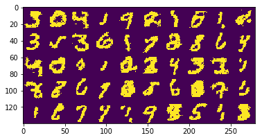

# Report for RBM

<center> 周海沧  15307130269 </center>

[TOC]

## 1. Methods

### 1.1. 理论 

这里我采用了讲义上介绍的基于 CD-k (对比散度) 的方法，并设置 k 为 1 (算法在讲义上都有呈现)。

### 1.2 代码

我先使用 numpy 进行实现其对应的类和类接口为：

```python
class RBM:
    def __init__(self, n_hidden=2, n_observe=784):
  	def train(self, data, T=10, learning_rate=0.01, batch_size=16, log=False):
    def sample(self, n=1, T=10, spciman=None):
```

但是由于 numpy 在 cpu 上进行运算，训练速度很慢，因此我将代码在 pytorch 上重构，并在 gpu 服务器上进行训练。

```python
class RBMtorch():
    def __init__(self, n_hidden=2, n_observe=784):
    def train(self, data, T=10, learning_rate=0.005, batch_size=16, log=False, gpu=False):
    def sample(self, n=1, T=10, spciman=None):
```

它们的类接口几乎是一样的，不同点是 pytorch 代码中有是否使用 gpu 的选项，而 sample 返回的是一个 torch.Tensor

代码使用的示例见 `run.py` (训练并保存模型) 和 `show.ipynb` (读取训练好的模型并展示采样效果)。

#### 1.2.1 特点

书上的 CD-k 是使用的 SGD 进行近似更新，但是这并不适合于在 gpu 上进行加速，因此我将其改成了 mini-batch（我将 batch size 设为4，这在我的服务器上能够发挥出比较好的性能）。另外，在采样的时候，我也对 m 个数据同时进行采样（相当于独立同分布），在 gpu 上，由于并行，这样并不会增加过多的计算时间，但是却能够让采到的样本之间独立。

对于每个 epoch ，我生成了一个 random permutation 来表示每个 batch 对应的数据的 index，代码如下。这样就实现了 random shuffle，但是这并不是在原始的庞大的数据集上进行操作，而只是对 index 进行了 shuffle。

```python
indexes = torch.randperm(num_batch).cuda()
    for n in indexes:
        if (n + 1) * batch_size <= N:
            end = (n + 1) * batch_size
        else:
            end = N
        v = data[n * batch_size: end, :].t()
```

另外，我使用了 pickle 进行模型的保存和装载。

## 2. Results

在 `show.ipynb` 中，我已经有了展示的代码和样例。这里我把一个结果放在下面：



这是用 MNIST 前 $5 \times 10$ 个样本采样得到的结果，图中绝大部分的数字的辨识度还是很高的。而且在这个图中，生成了从 0 - 9 这 10 个数字，因此模型还是学习到了整个的分布。

### 2.1 参数调整

上面结果的超参数设置是 196 个隐变量，0.005 的 learning_rate，30 个 epoch，batch_size=4。

在整个训练的过程中，我使用了比较传统的 grid search 的方法进行参数调整，发现隐变量数目过大和过小都效果不好，而 learning_rate 产生的影响似乎不大（0.01 - 0.0001 都还行）。而 epoch 则是过大的时候反而生成的效果不好，因此我算是使用了 early stopping 的方法。

### 2.2 结果分析

这里的 rbm 总体上还是一个比较浅的模型，因此并不能够学习得很精细，但是从上面的结果来看，其实也基本上学到了对应的分布特征。因此如果需要学习得更精细的话，就应该使用 GAN 这种深度的生成模型。